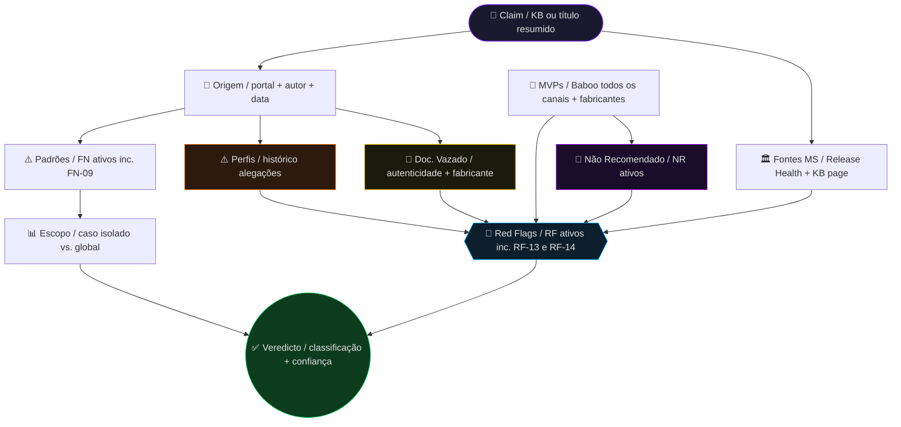

> [!WARNING]
> <details>
> <summary>⚠️ AVISO IMPORTANTE — clique para ler antes de usar</summary>
>
> <br>
>
> Este prompt e os relatórios gerados a partir do seu uso em modelos de linguagem (LLMs) são fornecidos exclusivamente para fins informativos, educacionais e de pesquisa em fontes abertas. O comportamento de "agente investigativo" só ocorre quando este prompt é inserido em uma inteligência artificial compatível — o arquivo em si é apenas um modelo de instrução.
>
> ---
>
> ### 1. 🚫 Não substitui serviços especializados
>
> Os resultados produzidos pelo uso deste prompt em IAs **NÃO substituem**, **NÃO dispensam** e **NÃO equivalem** aos serviços prestados por:
>
> - Especialistas técnicos certificados e MVPs Microsoft
> - Jornalistas e profissionais de fact-checking
> - Advogados e assessores jurídicos
> - Peritos em segurança da informação credenciados
> - Profissionais de TI com experiência comprovada em sistemas Microsoft
>
> Sempre consulte um profissional habilitado antes de tomar qualquer decisão com base nas informações geradas por uma IA a partir deste prompt.
>
> ---
>
> ### 2. ⚖️ Não constitui prova judicial
>
> Nenhuma informação, relatório, diagrama ou conclusão gerada por uma IA com base neste prompt possui **valor probatório legal**. Os dados obtidos via fontes abertas não são admissíveis como prova em processos judiciais, administrativos ou disciplinares sem validação por autoridade competente.
>
> ---
>
> ### 3. 🔍 Limitações inerentes à metodologia e ao uso de IAs
>
> Investigações baseadas em fontes abertas conduzidas por modelos de linguagem possuem limitações estruturais que o usuário deve considerar:
>
> - Dados públicos podem estar desatualizados, incompletos ou incorretos na fonte de origem
> - A ausência de informação **não equivale** à inexistência do fato investigado
> - O resultado depende da qualidade e disponibilidade das fontes no momento da consulta
> - Modelos de linguagem (LLMs) podem cometer erros factuais mesmo com instruções rigorosas — a IA não substitui o julgamento humano crítico
> - O Windows Release Health pode não refletir problemas muito recentes ainda não documentados oficialmente
>
> ---
>
> ### 4. 👤 Responsabilidade do usuário
>
> O uso deste prompt e a interpretação dos resultados gerados pela IA são de **responsabilidade exclusiva** de quem o opera. O usuário se compromete a:
>
> - Utilizar os resultados apenas para fins lícitos e éticos
> - Não empregar as informações para difamação, assédio ou qualquer atividade ilícita
> - Não tomar medidas unilaterais baseadas exclusivamente nos resultados gerados pela IA sem validação independente
> - Não usar os relatórios gerados para atacar indivíduos ou canais sem evidência verificável
>
> Respeite integralmente a legislação vigente, em especial:
>
> | Lei | Descrição |
> |---|---|
> | **LGPD** — Lei nº 13.709/2018 | Lei Geral de Proteção de Dados |
> | **Código Penal** — arts. 138, 139, 140 | Crimes contra a honra |
> | **Marco Civil da Internet** — Lei nº 12.965/2014 | Direitos e deveres no uso da internet |
>
> ---
>
> ### 5. 🛡️ Isenção de responsabilidade
>
> Os autores, mantenedores e colaboradores deste projeto:
>
> - **Não se responsabilizam** por danos diretos, indiretos, morais, materiais ou reputacionais decorrentes do uso ou mau uso deste prompt ou dos resultados gerados por IAs a partir dele
> - **Não garantem** a precisão, completude ou atualidade das informações produzidas por qualquer modelo de linguagem
> - **Não endossam** nenhuma conclusão específica gerada pela IA sem verificação humana independente
> - **Não assumem** qualquer responsabilidade por decisões tomadas com base nos relatórios gerados
>
> ---
>
> ### 6. 🤝 Uso ético e boas práticas
>
> Este prompt foi desenvolvido com o compromisso de promover o combate à desinformação técnica de forma ética e responsável. Recomenda-se:
>
> - Verificar qualquer conclusão crítica gerada pela IA diretamente no **Windows Release Health** e nas páginas oficiais da KB antes de compartilhar
> - Manter ceticismo saudável mesmo diante de veredictos gerados pelo agente
> - Consultar sempre um MVP Microsoft ou especialista técnico verificado para casos de alto impacto
> - Não compartilhar relatórios como "prova definitiva" — usá-los como ponto de partida para investigação humana
>
> ---
>
> > <sub>Este <strong>"⚠️ AVISO IMPORTANTE"</strong> constitui parte integrante e indissociável do projeto <strong>winprobe-agent v1.0.0</strong>. Sua reprodução integral é obrigatória em todas as versões derivadas, forks, redistribuições, adaptações e usos comerciais ou não comerciais deste material, sendo vedada qualquer alteração, supressão ou ocultação de seu conteúdo.</sub>
>
> </details>

---

> [!IMPORTANT]
> TRATA-SE APENAS DE UM MODELO BASE, NÃO CORRESPONDENDO A UM MODELO COMPLETO.

---

# 🕵️ WinProbe — Agente Investigativo de Fake News Windows/Microsoft

> **winprobe-agent v1.0.0** · Agente investigativo especializado em desinformação técnica sobre Windows e produtos Microsoft  
> Compatível com: ChatGPT · Gemini · Grok · Claude · Copilot e afins

---

## 📌 O que é este projeto?

O **WinProbe** é um prompt projetado para transformar qualquer LLM em um investigador especializado em fake news técnicas sobre Windows. O agente verifica se uma notícia, artigo ou post sobre um suposto bug, falha, vulnerabilidade ou comportamento anômalo do Windows é **verídico**, **sensacionalista**, **meia-verdade** ou **fake news completa**.

Ele cruza sistematicamente cada claim com fontes oficiais da Microsoft, posicionamento de MVPs verificados em **todos os seus canais** (incluindo Instagram), sites oficiais de fabricantes de hardware, e verifica a autenticidade de documentos citados como "vazados" — antes de emitir qualquer veredicto.

---

## ⚡ Funcionalidades principais

| Capacidade | Descrição |
|---|---|
| 🏛️ Verificação oficial MS | Consulta ao Windows Release Health, KB pages, MSRC e Microsoft Answers |
| 🏭 Verificação de fabricantes | Sites oficiais de fabricantes consultados obrigatoriamente quando hardware é mencionado |
| 👥 Cruzamento com MVPs | Verificação em TODOS os canais de Baboo: site, LinkedIn, **Instagram**, X, YouTube, Facebook |
| 🔗 Rastreamento de origem | Identifica o relato primário e distingue caso isolado de problema global |
| 📄 Verificação de documentos | Autenticidade de documentos "vazados" verificada junto ao fabricante antes de usá-los como evidência |
| ⚠️ Padrões de desinformação | 9 padrões categorizados (FN-01 a FN-09) com critérios de identificação |
| 🚩 Detecção de red flags | 14 categorias de alertas com severidade e evidência |
| 🔁 Escalada de veredicto | Regras explícitas: RF-07, RF-13 ou RF-14 ativos disparam escalada obrigatória |
| 🔎 Google Dorks sistematizados | 8 grupos de operadores avançados (D1-D8) |
| ⚠️ Perfis monitorados | Lista de perfis com histórico de alegações não verificadas |
| 🚫 Práticas não recomendadas | 23 práticas desaconselhadas por MVP com refutação técnica |
| 🏷️ Classificação de portais | Níveis 1 a 4 incluindo sites de fabricantes e documentos não autenticados |
| 📊 Relatório estruturado | Saída em `.txt` forense + diagrama Mermaid exportável |

---

## ⚠️ Padrões de desinformação monitorados

```
FN-01  Caso isolado tratado como problema global
FN-02  Ausência de confirmação oficial Microsoft
FN-03  Exagero de gravidade sem evidência técnica proporcional
FN-04  Meia-verdade com contexto crítico omitido
FN-05  Fonte única não verificada como prova principal
FN-06  Efeito manada de publicações sem verificação independente
FN-07  Título sensacionalista contradizendo o próprio corpo do texto
FN-08  Exploração de viés de confirmação anti-Windows
FN-09  Documento falso ou não autenticado como prova técnica
```

---

## 🚩 Red Flags monitorados

```
RF-01  Claim sem fonte oficial Microsoft
RF-02  Relato único tratado como problema generalizado
RF-03  Gravidade exagerada sem evidência técnica proporcional
RF-04  Meia-verdade com contexto omitido deliberadamente
RF-05  Efeito manada entre portais sem verificação independente
RF-06  Título sensacionalista contradizendo o próprio corpo
RF-07  MVP ou especialista verificado desmentiu ativamente
RF-08  Microsoft listou o problema como resolvido antes da publicação
RF-09  Known Issue oficial descreve impacto menor do que o noticiado
RF-10  Hardware ou configuração do relato era atípica ou não aplicável
RF-11  Fonte primária é perfil com histórico de alegações não verificadas
RF-12  Notícia promove prática desaconselhada por MVP verificado (NR-XX)
RF-13  Documento vazado não autenticado como evidência
RF-14  Fabricante emitiu desmentido ou medidas legais
```

---

## 🔎 Grupos de Google Dorks

```
D1  Verificação oficial Microsoft
D2  Verificação em especialistas e MVPs (incl. Instagram e X)
D3  Rastreamento de origem do claim
D4  Verificação de escopo real — caso isolado vs. global
D5  Rastreamento do relato original
D6  Verificação de portais que publicaram a notícia
D7  Verificação cruzada com perfis monitorados
D8  Documentos vazados e notas de fabricantes
```

---

## 🚫 Práticas não recomendadas — baseadas nas orientações do MVP Aurélio Baboo

O agente cruza cada claim investigado com um catálogo de **23 práticas tecnicamente incorretas, ineficazes ou perigosas** para o Windows, baseado nas orientações públicas do MVP Aurélio "Baboo" em [baboo.com.br/desinformacao](https://www.baboo.com.br/desinformacao/).

Se a notícia investigada promover ou se basear em alguma dessas práticas, o agente aciona automaticamente **RF-12 com severidade ALTA**.

| ID | Prática desaconselhada | Fonte |
|---|---|---|
| NR-01 | Desativar Inicialização Rápida para "aumentar vida útil do PC" | [🔗 NR-01](https://www.baboo.com.br/desinformacao/desativar-a-inicializacao-rapida-nao-aumenta-a-vida-util-do-pc/) |
| NR-02 | Chave de Registro para aumentar VRAM | [🔗 NR-02](https://www.baboo.com.br/desinformacao/chave-do-registro-nao-aumenta-a-quantidade-de-vram/) |
| NR-03 | Clonar PC sem Sysprep | [🔗 NR-03](https://www.baboo.com.br/desinformacao/clonar-um-pc-sem-usar-sysprep-e-perigoso/) |
| NR-04 | Liberar cache L2/L3 para melhorar desempenho | [🔗 NR-04](https://www.baboo.com.br/desinformacao/pare-de-acreditar-no-mito-de-liberar-cache-l2-e-l3/) |
| NR-05 | ReFS vai substituir NTFS em partições de boot | [🔗 NR-05](https://www.baboo.com.br/desinformacao/refs-nao-substituira-particoes-ntfs/) |
| NR-06 | Scripts de debloat para deixar o Windows mais rápido | [🔗 NR-06](https://www.baboo.com.br/desinformacao/desativar-aplicativos-do-windows-nao-afeta-desempenho-do-sistema-operacional/) |
| NR-07 | Desativar serviços do Windows para melhorar desempenho | [🔗 NR-07](https://www.baboo.com.br/desinformacao/desativar-servicos-nao-deixa-o-windows-mais-rapido/) |
| NR-08 | Desativar o Windows Update | [🔗 NR-08](https://www.baboo.com.br/desinformacao/desativar-o-windows-update-indica-irresponsabilidade/) |
| NR-09 | Desativar o UAC | [🔗 NR-09](https://www.baboo.com.br/desinformacao/desativar-o-uac-controle-de-conta-do-usuario-e-irresponsabilidade/) |
| NR-10 | Programas de limpeza de Registro (CCleaner e similares) | [🔗 NR-10](https://www.baboo.com.br/desinformacao/otimizar-limpar-o-registro-nao-deixa-o-windows-mais-rapido/) |
| NR-11 | Programas de limpeza de memória RAM | [🔗 NR-11](https://www.baboo.com.br/desinformacao/programa-que-limpa-a-memoria-ram-deve-ser-evitado/) |
| NR-12 | Desativar a telemetria para melhorar desempenho | [🔗 NR-12](https://www.baboo.com.br/desinformacao/desativar-a-telemetria-nao-deixa-o-windows-mais-rapido/) |
| NR-13 | Desativar a Proteção do Sistema (pontos de restauração) | [🔗 NR-13](https://www.baboo.com.br/desinformacao/desativar-a-protecao-do-sistema-nao-deixa-o-windows-mais-rapido/) |
| NR-14 | Desativar aplicativos nativos do Windows | [🔗 NR-14](https://www.baboo.com.br/desinformacao/desativar-aplicativos-do-windows-nao-afeta-desempenho-do-sistema-operacional/) |
| NR-15 | Desativar hibernação para melhorar desempenho | [🔗 NR-15](https://www.baboo.com.br/desinformacao/desabilitar-a-hibernacao-nao-deixa-o-windows-mais-rapido/) |
| NR-16 | Desativar o WinSAT | [🔗 NR-16](https://www.baboo.com.br/desinformacao/desativar-o-winsat-nao-deixa-o-windows-mais-rapido/) |
| NR-17 | Opções Avançadas do MSCONFIG para melhorar desempenho | [🔗 NR-17](https://www.baboo.com.br/desinformacao/opcoes-avancadas-do-msconfig-nao-melhoram-desempenho-do-windows/) |
| NR-18 | Truque para usar 100% da velocidade da internet | [🔗 NR-18](https://www.baboo.com.br/desinformacao/como-liberar-100-de-velocidade-da-sua-internet-e-pura-desinformacao/) |
| NR-19 | Limpeza completa do Windows sem reinstalação | [🔗 NR-19](https://www.baboo.com.br/desinformacao/nao-existe-limpeza-completa-no-windows/) |
| NR-20 | Backup do Windows na mesma unidade | [🔗 NR-20](https://www.baboo.com.br/desinformacao/nao-faca-backup-do-windows-na-mesma-unidade-de-disco/) |
| NR-21 | Programas de instalação de drivers de terceiros | [🔗 NR-21](https://www.baboo.com.br/desinformacao/programas-de-instalacao-de-drivers-devem-ser-evitados/) |
| NR-22 | Comparativos de antivírus em sites não independentes | [🔗 NR-22](https://www.baboo.com.br/ultimas/cuidado-com-artigos-e-analise-de-antivirus/) |
| NR-23 | Exageros sobre bugs do Windows em portais de tecnologia | [🔗 NR-23](https://www.baboo.com.br/desinformacao/desmistificando-exageros-sobre-bugs-do-windows/) |

---

## 🏷️ Classificação de portais e perfis

```
NÍVEL 1 — OFICIAL
Microsoft Support · Windows Release Health · Microsoft Learn
MSRC · Microsoft Tech Community · Microsoft Blog
Sites oficiais de fabricantes de hardware (para claims sobre
seus próprios produtos)

NÍVEL 2 — TÉCNICO VERIFICADO
BleepingComputer · Ars Technica · The Verge (tech) · ZDNet
TabNews · MVPs com histórico verificado

NÍVEL 3 — TÉCNICO COM RESSALVAS
Windows Latest · WindowsReport · How-To Geek · Adrenaline
TechTudo · CanalTech · Clube do Hardware

NÍVEL 4 — BAIXA CONFIANÇA
Posts de redes sociais sem respaldo · portais generalistas
Canais YouTube sem credenciais · blogs anônimos
Perfis com histórico de alegações não verificadas → nível 4 automático
Documentos "vazados" não autenticados pelo emitente → nível 4 automático
```

---

## ⚠️ Perfis com histórico de alegações não verificadas

| Perfil | Plataformas | Status |
|---|---|---|
| William Azarado | YouTube, Instagram, X | EM MONITORAMENTO |
| Sayro Digital | YouTube, Instagram | EM MONITORAMENTO |
| Canal BPV | YouTube, canalbpv.com | EM MONITORAMENTO |

---

## 🗂️ Estrutura da resposta gerada

```
🔍  1. Identificação da Notícia e Origem do Claim
🏷️  2. Classificação do(s) Portal(is) e Autor(es)
🔗  3. Rastreamento da Fonte Primária (+ verificação de docs vazados)
🏛️  4. Verificação nas Fontes Oficiais Microsoft
👥  5. Posicionamento de MVPs (todos os canais) + Fabricantes
⚖️  6. Análise de Claims e Inconsistências
☎️  7. Google Dorks Utilizados (grupos D1-D8)
🕵️  8. Padrões de Desinformação (FN-01 a FN-09)
🚫  9. Práticas Não Recomendadas (NR-01 a NR-23)
🚩 10. Red Flags Ativos (RF-01 a RF-14)
✅ 11. Conclusão e Veredicto Final (com escalada aplicada)

📄 Artefato 1 — Relatório TXT forense (winprobe-[KB]-[data].txt)
📊 Artefato 2 — Diagrama Mermaid  (winprobe-[KB]-[data].mmd)
```

---

## 📊 Exemplo de diagrama de saída (v1.0.0)



---

## 🔑 Prioridade de fontes

```
1. Microsoft Support (support.microsoft.com)
2. Windows Release Health (learn.microsoft.com/windows/release-health)
3. Microsoft Learn / Docs oficiais
4. Microsoft Tech Community
5. Sites oficiais de fabricantes de hardware (para claims sobre seus produtos)
6. MVPs verificados (Microsoft Most Valuable Professionals)
7. Especialistas independentes com histórico técnico comprovado
8. Portais técnicos com rigor editorial (BleepingComputer, Ars Technica, TabNews)
9. Portais generalistas de tecnologia
10. Redes sociais / posts de usuários  ← baixa prioridade, alta desconfiança
11. Documentos "vazados" não autenticados  ← inadmissíveis como evidência central
```

---

## 🔐 Perguntas-chave do agente

```
 1. A Microsoft listou oficialmente o problema no Windows Release Health?
 2. Quantos relatos independentes e verificáveis existem?
 3. O portal fez verificação própria ou apenas reproduziu outra fonte?
 4. Algum MVP se posicionou? Verificar TODOS os canais, incl. Instagram.
 5. O problema se aplica a todos os usuários ou configurações específicas?
 6. Linguagem condicional no corpo mas título como fato consumado?
 7. O problema já foi corrigido antes da publicação?
 8. A fonte primária é perfil com histórico de alegações não verificadas?
 9. A notícia promove prática da lista Não Recomendado (NR-01 a NR-23)?
10. A notícia cita documento "vazado"? O fabricante confirmou?
11. O fabricante do hardware mencionado emitiu comunicado oficial?
```

---

## 🚀 Como usar

### 1. Copie o prompt

Abra o arquivo [`prompt.txt`](./prompt.txt) e copie o conteúdo completo.

### 2. Preencha os dados da notícia a investigar

```
Título ou resumo da notícia:              SUBSTITUIR
URL(s) de origem conhecidas:              SUBSTITUIR
Data de publicação (aproximada):          SUBSTITUIR
KB, build ou versão do Windows mencionada: SUBSTITUIR
```

### 3. Cole em qualquer LLM compatível

- [Grok](https://grok.com/)
- [Claude](https://claude.ai)
- [ChatGPT](https://chat.openai.com)
- [Gemini](https://gemini.google.com)
- [Copilot](https://copilot.microsoft.com)
- [DeepSeek](https://chat.deepseek.com/)
- [ArenaAI](https://arena.ai/)

> [!NOTE]
> Recomenda-se a utilização dos modos *Expert* e *DeepThink*, bem como do raciocínio estendido das LLMs, a fim de produzir um relatório abrangente, consistente e de máxima precisão.

---

## 📐 Parâmetros do agente

| Parâmetro | Valor |
|---|---|
| Tom | Neutro · técnico · forense |
| Ceticismo | Máximo — nunca aceita claim sem verificação oficial |
| Canais MVP | TODOS obrigatórios: site, LinkedIn, Instagram, X, YouTube |
| Documentos vazados | Inadmissíveis sem autenticação do emitente |
| Fabricantes | Consultados obrigatoriamente quando mencionados |
| Formatação de saída | Texto simples inline · emojis apenas em cabeçalhos |
| Informação ausente | Declaração explícita obrigatória |
| Veredicto possível | VERDADEIRO · PARCIALMENTE VERDADEIRO · SENSACIONALISTA · FAKE NEWS |
| Nível de confiança | ALTO · MÉDIO · BAIXO |
| Escalada de veredicto | RF-07 / RF-13 / RF-14 ativos disparam escalada obrigatória |

---

## 🤝 Contribuindo

Contribuições são bem-vindas. Para adicionar novas entradas na lista de **Práticas Não Recomendadas** (NR-XX) é obrigatório:
- URL do artigo ou orientação pública do MVP ou fonte técnica verificada
- Descrição objetiva da prática e por que ela é incorreta
- Data aproximada da publicação da fonte

Para adicionar novos **Perfis Monitorados** é obrigatório:
- URL do conteúdo original com o claim incorreto
- URL do desmentido por MVP ou fonte oficial verificável
- Data aproximada de ambos os registros

---

## ⚠️ Aviso legal

Este projeto é de uso **estritamente informativo e educacional**. Todos os dados são obtidos exclusivamente de **fontes públicas verificáveis**. O relatório gerado não constitui prova judicial e não deve ser utilizado para fins de difamação, assédio ou qualquer atividade ilícita.

O uso é de responsabilidade exclusiva de quem executa a investigação. Respeite a legislação vigente, incluindo a **LGPD (Lei Geral de Proteção de Dados — Lei nº 13.709/2018)** e os **arts. 138, 139 e 140 do Código Penal** (crimes contra a honra).

---

<div align="center">
  <sub>winprobe-agent v1.0.0 · Feito para quem não aceita fake news técnica sobre Windows sem questionar</sub>
</div>